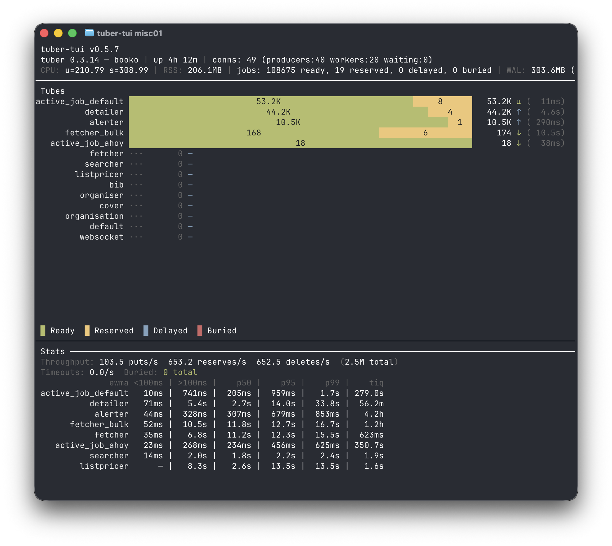

# tuber

A simple, fast job queue server. One binary, zero dependencies. Running in production at [Booko.au](https://booko.au) where it's already processed jobs in the tens of millions, and newly available in [Splat](https://github.com/dkam/splat).

Tuber is a re-write of Beanstalkd in Rust. It brings along priority queues, delayed jobs, job reservations, and named tubes — and adds unique jobs, concurrency control, job group pipelines, batch operations, weighted queues, and offloaded job bodies.

[](https://github.com/tuberq/tuber-rs)
*[tuber-tui](https://github.com/tuberq/tuber-rs) — a terminal dashboard compatible with both Tuber and Beanstalkd.*

## Why Tuber?

Job queues today fall into two camps, and both make compromises.

**RAM-based queues** — Redis-backed Sidekiq (Ruby), BullMQ (Node), RQ (Python), Faktory, and Beanstalkd (which Tuber rewrites) — are fast, but every job lives in memory. Your queue depth is capped by host RAM, and a backlog of jobs with large payloads can push you into swap or OOM. (Celery is broker-agnostic but is most commonly deployed against Redis or RabbitMQ.) Redis adds a second problem: it's a general-purpose data store, not a queue, so priorities, delays, reservations, and timeouts are bolted on with complexity growing at every edge case.

**Disk-based queues** — Solid Queue and GoodJob (Ruby), pg-boss (Node), Procrastinate (Python), River (Go) — solve the capacity problem by piggybacking on your relational database, but the queue workload is a bad fit for MVCC storage engines. High-churn job tables generate dead tuples faster than autovacuum can reclaim them, indexes bloat, and dequeue queries (`FOR UPDATE SKIP LOCKED`) get slower as the backlog grows. You also inherit the operational weight of the database — connection pooling, tuning, vacuuming, backups — and either share capacity with your application or run a second instance.

**Tuber takes both.** Metadata stays in RAM for fast reserve/release/delete, backed by an optional write-ahead log for durability. **Larger job bodies live on disk, not in RAM** — they're offloaded using a TOAST-style scheme (inspired by PostgreSQL), so memory usage stays bounded regardless of payload size or queue depth. Small bodies (≤ 256 B, typical for UUIDs, IDs, short envelopes) ride along inside their WAL record — they're never copied to the body store, so they avoid TOAST overhead entirely. You get RAM-speed coordination with disk-scale capacity, in a single binary with no database to tune. Unlike beanstalkd — which keeps every job body resident in memory — tuber's RAM footprint is a function of job *count*, not job *size*.

Tuber is wire-compatible with [beanstalkd](https://github.com/beanstalkd/beanstalkd), so [dozens of client libraries](https://github.com/beanstalkd/beanstalkd/wiki/Client-Libraries) work out of the box across every major language. For Tuber's extended features (idempotency, job groups, concurrency keys), see the [beaneater tuber fork](https://github.com/tuberq/beaneater/tree/tuber) for Ruby.

### Feature Comparison

| Feature | Tuber | Beanstalkd | Sidekiq + Redis | BullMQ | GoodJob | Solid Queue | RabbitMQ |
| --- | --- | --- | --- | --- | --- | --- | --- |
| **Unique / idempotent jobs** | Yes | — | Pro/Enterprise ¹ | Yes | Yes | Yes ² | — ³ |
| **Concurrency control** | Yes (per-key) | — | Enterprise ¹ | Yes (rate limit) | Yes | Yes | — |
| **Fan-in batches** | Yes | — | Pro ¹ | Yes (flows) | Yes ⁴ | — | — |
| **Multi-stage DAG pipelines** | Yes | — | — | Yes (flows) | — ⁴ | — | — |
| **Weighted queues** | Yes | — | Yes | — | — | — | — |
| **Per-job priority** | Yes (numeric) | Yes (numeric) | Queue-level ⁵ | Yes | Yes | Yes | Yes |
| **Delayed jobs** | Yes | Yes | Yes | Yes | Yes | Yes | Via plugin |
| **Batch reserve / delete** | Yes | — | — | — | — | — | Prefetch |
| **Memory backpressure** | Yes ¹⁰ | — | Redis `maxmemory` ¹¹ | Redis `maxmemory` ¹¹ | DB limits | DB limits | Memory alarms ¹² |
| **Processing time stats** | EWMA + p50/p95/p99 | — | Histogram ⁷ | Metrics events | In DB ⁸ | — | — |
| **Queue latency stats** | EWMA + min/max | — | Oldest only ⁹ | Oldest only ⁹ | In DB ⁸ | — | — |
| **Persistence** | WAL, ~100ms fsync | WAL, ~100ms fsync | Redis RDB/AOF | Redis RDB/AOF | PostgreSQL | DB ⁶ | Durable queues |
| **Infrastructure** | None (single binary) | None (single binary) | Redis | Redis | PostgreSQL | DB ⁶ | Erlang runtime |

<sub>¹ Sidekiq OSS has queue weights and basic job processing. Unique jobs and batches require [Pro](https://sidekiq.org/products/pro.html); concurrency controls require [Enterprise](https://sidekiq.org/products/enterprise.html).</sub>
<sub>² Solid Queue unique jobs available from Rails 7.2+.</sub>
<sub>³ RabbitMQ has a community deduplication plugin, but no built-in uniqueness.</sub>
<sub>⁴ GoodJob batches support single-level fan-out/fan-in (enqueue N jobs, fire a callback when all complete). Multi-stage pipelines require manually chaining batches inside callbacks. BullMQ flows support arbitrary DAGs natively.</sub>
<sub>⁵ Sidekiq uses queue-level ordering (strict or weighted), not per-job numeric priority.</sub>
<sub>⁶ Solid Queue supports SQLite, PostgreSQL, or MySQL.</sub>
<sub>⁷ Sidekiq 7+ tracks execution time per job class in exponential histogram buckets. No percentiles without external APM.</sub>
<sub>⁸ GoodJob stores timestamps in PostgreSQL — you can query for percentiles with SQL, but nothing is computed or displayed by default.</sub>
<sub>⁹ `Queue#latency` and BullMQ's queue age return the age of the oldest job only, not a distribution. SQS has a similar `ApproximateAgeOfOldestMessage`.</sub>
<sub>¹⁰ Tuber's `--max-jobs-size` rejects new `put` commands with `OUT_OF_MEMORY` when the budget is full, but workers can always reserve, release, bury, kick, and delete — the queue keeps draining even at capacity.</sub>
<sub>¹¹ Redis `maxmemory` with an eviction policy can drop data silently. With `noeviction`, writes fail but workers have no built-in handling — they stall on Redis errors.</sub>
<sub>¹² RabbitMQ blocks publishers when memory or disk alarms fire, but also blocks consumers on the same connection — a full queue can prevent workers from ACKing messages, causing a deadlock. Tuber's design avoids this by only gating `put`.</sub>

## Features

### Storage architecture

Tuber's defining design choice is splitting job storage between RAM and disk. Job *metadata* (state, priority, timing, tags) lives in RAM for fast reserve/release/delete. Large job *bodies* live on disk in an append-only body store, addressed by an opaque `BodyId` in the WAL. Small bodies (≤ 256 B) stay inline inside their WAL record — they're never written to the body store, so they skip the TOAST overhead and per-body fsync coordination entirely.

- **Per-job RAM cost is ~512 bytes for externalised bodies regardless of body size.** A 1 MB job uses the same RAM as a 10 KB job. In practice, 1058 active jobs with 1 MB bodies cost ~1 GiB on disk and ~540 KB in RAM — roughly 2000× more capacity at the same RAM budget vs. an in-memory queue. The queue scales by job *count*, not job *size*.
- **Cheap fsyncs for large-body workloads.** WAL records for externalised bodies carry metadata plus an 8-byte body reference, so the latency-critical WAL fsync flushes a constant ~100 bytes per record. fsync overhead stays flat as body size grows.
- **Optional persistence.** Pass `-b <dir>` to enable the WAL + body store. Without it, tuber runs fully in-memory and loses state on restart — fine for ephemeral workloads.
- **Replay-aware readiness.** When persistence is on, tuber binds the listener *only after* WAL replay completes. Connect-refused during replay, accepting once ready. Docker's `HEALTHCHECK` and external TCP probes get an accurate signal even on a multi-minute replay. See [Readiness & Health Checks](#readiness--health-checks).

### Job semantics

The beanstalkd primitives, intact:

- **Priority queues** — lower priority number = more urgent. Priority < 1024 is "urgent."
- **Delayed jobs** — submit now, become available after a delay.
- **Time-to-run (TTR)** — if a worker doesn't finish within TTR seconds, the job returns to ready.
- **Named tubes** — separate queues, default is `default`.
- **Bury & kick** — set aside problem jobs, kick them back to ready when fixed.
- **Peek** — inspect jobs without reserving them.
- **Pause** — temporarily stop a tube from serving jobs.

Plus tuber's extensions — see [Unique Jobs](#unique-jobs-idempotency), [Job Dependencies](#job-dependencies-fan-out--fan-in), [Concurrency Keys](#concurrency-keys), [Weighted Reserve](#weighted-reserve), and [Batch Operations](#batch-operations).

### Operations

Tuber has two independent budgets — RAM and disk — and both gate **only `put`**. Workers can always reserve, release, bury, kick, touch, and delete, even at capacity. The queue keeps draining when it's full; producers get an explicit `OUT_OF_*` rather than a silent crash, and there's no consumer-blocking deadlock of the kind RabbitMQ's memory alarm can produce.

- **Memory budget** — `--max-jobs-size` caps in-memory job footprint (metadata + idempotency tombstones with persistence on; full job bytes without). Defaults to 1 GiB, so backpressure is on out of the box; pass `0` to opt out. PUT returns `OUT_OF_MEMORY` when exhausted — explicit backpressure instead of a silent OOM kill. Workers can always reserve, release, bury, kick, and delete; state transitions never fail due to the budget. The cap also applies at startup, so tuber aborts with a diagnostic instead of OOMing mid-replay.
- **Storage budget** — `--max-storage-bytes` (mandatory with `-b`) caps WAL + body-store disk usage. PUT returns `OUT_OF_STORAGE` once exceeded; state changes always succeed because tuber reserves one WAL segment's headroom for delete/release/bury/kick records. No silent disk-fill outages.
- **Per-tube statistics** — processing-time and queue-time EWMAs, p50/p95/p99 percentiles, bury rate. See [Statistics](#statistics) below.
- **Prometheus metrics** — `/metrics` endpoint with gauges for queue depth, memory/storage budgets, and per-tube counters.
- **Drain mode** — `drain` (or `SIGUSR1`) rejects new puts with `DRAINING` while letting workers finish in-flight jobs. `undrain` resumes.

### Readiness & Health Checks

When persistence is on (`-b`), tuber binds the beanstalk TCP listener **only after WAL replay completes**. The port being reachable is the readiness signal — connect-refused during replay, accepting once ready. This makes false-healthy windows during a slow restart impossible, which matters when a 20 GB+ WAL can take minutes to replay.

- **Docker:** the published image ships `HEALTHCHECK ["tuber", "stats"]`. The check fails (connection refused) during replay and passes once the listener is up. Docker reports `starting` → `unhealthy` → `healthy` across a slow restart.
- **External monitors (Uptime Kuma, etc.):** point them at the beanstalk port (default `11300`) with a TCP-connect probe, or run `tuber stats` via `docker exec`. Don't probe the metrics port (`9100`) with TCP-only — `/metrics` is served by the same process but exists for Prometheus scrapes, not readiness.
- **What you'll see in the logs during replay:**

  ```text
  TOAST: scanning body store at "/var/lib/tuber/binlog/toast"
  TOAST scan: segment 87/320, 5.43 GiB / 19.84 GiB (27%), 412384 bodies indexed
  …
  WAL: replaying 1247 segments / 12.18 GiB from "/var/lib/tuber/binlog" (not yet accepting connections)
  WAL replay: segment 412/1247, 4.01 GiB / 12.18 GiB (32%), 891204 jobs so far
  …
  WAL: replayed 2480915 jobs and 1289 idempotency tombstones from "/var/lib/tuber/binlog"
  tuber vX.Y.Z [splat-booko] listening on 0.0.0.0:11300 …
  ```

  Progress lines are time-throttled to one every ~5 s, so they don't drown the log on small WALs.

### Statistics

Most job queue systems treat performance monitoring as the application's problem. Tuber tracks it at the broker, per tube, with no external tooling required:

- **Processing time** — EWMA, min, max, and sample count for how long workers take to complete jobs (reserve-to-delete).
- **Dual EWMA** — jobs are automatically split at a 100ms threshold into fast and slow buckets, each with its own EWMA. This surfaces bimodal distributions (e.g. idempotent fast-exits vs real work) that a single average would hide.
- **Percentiles** — p50, p95, p99 from the last 1000 samples. Uses slow-job samples when available, falls back to fast-job samples for tubes where all jobs are quick.
- **Queue time (time-in-queue)** — EWMA, min, and max of how long jobs waited from `put` to `reserve`. Growing queue time means you need more workers — and you'll know before your users do.
- **Bury rate** — fraction of reserves that ended in a bury, for quick failure monitoring.

All stats are available via `stats-tube`, the Prometheus `/metrics` endpoint, and [tuber-tui](https://github.com/tuberq/tuber-rs). See the full [Statistics Reference](docs/statistics.md) for field details, and [Connection & file-descriptor lifecycle](docs/connection-lifecycle.md) for the `fd-*` fields and what to alert on.

### Weighted Reserve

By default, `reserve` picks the highest-priority job across all watched tubes. Two weighted modes let you distribute work across tubes:

**`weighted`** — a tube is chosen randomly in proportion to its weight, then the highest-priority job from that tube is returned:

```text
watch email
watch notifications 2
watch another-tube 6
reserve-mode weighted
reserve
```

Tubes default to weight 1. Here, `another-tube` is selected 3x as often as `notifications` and 6x as often as `email`.

**`weighted-fair`** — like `weighted`, but adjusts for processing time so that **worker-time** (not job count) is allocated proportional to weights. Each tube's effective weight is `weight / processing_time_ewma`:

```text
reserve-mode weighted-fair
```

This prevents slow tubes from starving fast ones. For example, if `alerter` jobs take 0.1s and `fetcher` jobs take 10s, standard `weighted` with equal weights would lock workers on `fetcher` 99% of the time. With `weighted-fair`, selection compensates for the processing time difference so both tubes get an equal share of worker capacity. Tubes with no processing history yet fall back to raw weights.

### Unique Jobs (Idempotency)

Prevent duplicate jobs with an `idp:` key on `put`. If a job with the same key already exists in the tube, the original job ID is returned along with the existing job's state:

```text
put 100 0 30 5 idp:my-key
<body>
→ INSERTED 1

put 100 0 30 5 idp:my-key
<body>
→ INSERTED 1 READY       (dedup hit — job is ready)
```

#### Priority Ratchet

If a duplicate `put` arrives with a more urgent priority (lower number) than the existing job, the job's priority ratchets down and the new value is included in the response:

```text
put 100 0 30 5 idp:my-key
<body>
→ INSERTED 1

put 50 0 30 5 idp:my-key
<body>
→ INSERTED 1 READY 50    (dedup hit — priority ratcheted to 50)

put 200 0 30 5 idp:my-key
<body>
→ INSERTED 1 READY       (dedup hit — ratchet holds, no change)
```

The priority ratchets down (more urgent), never up — this prevents flapping when multiple producers disagree. The ratchet applies regardless of job state (ready, reserved, delayed, or buried); for non-ready jobs, the new priority takes effect on the next state transition.

The response state tells you exactly what happened to the original job:

| Response | Meaning |
|---|---|
| `INSERTED <id>` | Fresh insert, new job created |
| `INSERTED <id> READY` | Dedup hit — original job is waiting to be reserved |
| `INSERTED <id> READY <pri>` | Dedup hit — priority ratcheted to `<pri>` |
| `INSERTED <id> RESERVED` | Dedup hit — original job is being processed |
| `INSERTED <id> RESERVED <pri>` | Dedup hit — priority ratcheted (applies on release) |
| `INSERTED <id> DELAYED` | Dedup hit — original job is delayed |
| `INSERTED <id> DELAYED <pri>` | Dedup hit — priority ratcheted (applies when ready) |
| `INSERTED <id> BURIED` | Dedup hit — original job is buried |
| `INSERTED <id> BURIED <pri>` | Dedup hit — priority ratcheted (applies on kick) |
| `INSERTED <id> DELETED` | Dedup hit during TTL cooldown (see below) |

The state suffix only appears on dedup hits — a `put` without `idp:` always returns plain `INSERTED <id>`, keeping the response fully backwards-compatible with standard beanstalkd clients.

The key is scoped to the tube and cleared when the job is deleted, so the same key can be reused afterwards.

#### Cooldown TTL

By default, the idempotency key is removed as soon as the job is deleted. Add a TTL with `idp:key:N` to keep deduplicating for N seconds after deletion:

```text
put 0 0 30 5 idp:report:300
<body>
→ INSERTED 1

(reserve → delete job 1)

put 0 0 30 5 idp:report:300
<body>
→ INSERTED 1 DELETED     (still deduped — within 300s cooldown)
```

After the cooldown expires, the key is freed and a new job will be created. `idp:key` (no TTL) keeps the original behaviour — key removed immediately on delete.

### Job Groups (Fan-out / Fan-in)

Group related jobs together with `grp:` and chain dependent work with `aft:`. After-jobs are held until every job in the group they depend on has been deleted:

```text
put 0 0 30 11 grp:import
import-row-1
put 0 0 30 11 grp:import
import-row-2
put 0 0 60 14 aft:import
send-summary
```

The `send-summary` job stays held until both `import` group jobs are deleted. Buried jobs block group completion — kick them to let the group finish. If an `aft:` job isn't running and you're not sure why, use `stats-group <name>` to check whether the group still has pending or buried members.

Chain stages together by combining `aft:` and `grp:` on the same job — the job waits on one group while belonging to another:

```text
put 0 0 30 5 grp:extract
row-1
put 0 0 30 5 grp:extract
row-2
put 0 0 30 5 aft:extract grp:transform
transform
put 0 0 30 5 aft:transform
load
```

Here `transform` waits for the `extract` group to finish and is itself a member of the `transform` group. `load` waits for `transform` to complete — giving you a simple DAG pipeline.

Use `stats-group <name>` to inspect group state — useful for debugging why `aft:` jobs aren't running:

```text
stats-group import
→ OK <bytes>
---
name: "import"
pending: 2
buried: 1
complete: false
waiting-jobs: 1
```

A buried job blocks group completion (`complete: false`). Kick it to let the group finish.

- **Group names are global** — jobs in the same group can span multiple tubes.
- **No cycle detection** — if two groups depend on each other, the waiting jobs will be held indefinitely. Cycle avoidance is the client's responsibility.

### Concurrency Keys

Limit parallel processing of related jobs. When a job with a `con:` key is reserved, other ready jobs sharing the same key are hidden from `reserve` until the reservation ends (via delete, release, bury, TTR timeout, or disconnect):

```text
put 0 0 30 7 con:user-42
payload1
put 0 0 30 7 con:user-42
payload2
```

Only one `con:user-42` job can be reserved at a time, ensuring serial processing per key.

Set a higher limit with `con:key:N` to allow N concurrent reservations:

```text
put 0 0 30 7 con:api:3
payload1
put 0 0 30 7 con:api:3
payload2
```

Up to 3 `con:api` jobs can be reserved simultaneously. `con:key` (no `:N`) defaults to a limit of 1.

Burying or releasing-with-delay a job frees its concurrency slot immediately — the slot is only held while the job is reserved. Delayed jobs don't occupy a slot until they become ready and are reserved. Use `stats-job <id>` to check a job's current state if reserves are unexpectedly blocked.

### Batch Operations

Reduce round trips when working with many jobs at once.

#### reserve-batch

Reserve up to N jobs in a single call (1–1000). Returns immediately with whatever is available — if fewer jobs are ready than requested, you get fewer:

```text
reserve-batch 5
→ RESERVED_BATCH 3
→ RESERVED 1 5
→ hello
→ RESERVED 2 5
→ world
→ RESERVED 3 7
→ goodbye
```

The response starts with `RESERVED_BATCH <count>`, followed by standard `RESERVED <id> <bytes>\r\n<body>\r\n` entries for each job. If no jobs are available, `RESERVED_BATCH 0` is returned.

#### delete-batch

Delete multiple jobs in a single call (1–1000 IDs, space-separated):

```text
delete-batch 1 2 3 99
→ DELETED_BATCH 3 1
```

Returns `DELETED_BATCH <deleted_count> <not_found_count>` — here 3 jobs were deleted and 1 was not found.

## Installation

### Cargo

```bash
cargo install --git https://github.com/tuberq/tuber
```

Pre-built binaries for Linux and macOS are available on the [releases page](https://github.com/tuberq/tuber/releases).

### Docker

```bash
docker run ghcr.io/tuberq/tuber server -l 0.0.0.0 -p 11300
```

### Building from source

```bash
cargo build --release
```

The binary will be at `target/release/tuber`.

## Using Tuber from the Shell

`tuber put` and `tuber work` make tuber usable as a distributed shell task runner — no client library required. Queue commands as strings, workers execute them as shell commands. Handy for cron-like workloads, batch jobs, ad-hoc pipelines, and driving tuber during development or debugging.

For application integration, use a [beanstalkd client library](https://github.com/beanstalkd/beanstalkd/wiki/Client-Libraries) in your language of choice — tuber speaks the beanstalkd wire protocol.

> Flags used below (`-t`, `-g`, `-i`, `-c`, `--aft`, `-j`, etc.) are summarised in the [CLI Reference](#cli-reference).

### Basics

```bash
# Start the server
tuber server

# Put a job
tuber put "echo hello world"

# Put jobs from stdin (one per line)
echo -e "job1\njob2\njob3" | tuber put

# Process jobs (reserves and runs each job body as a shell command)
tuber work

# List tubes
tuber tubes

# Check stats
tuber stats
```

### Background jobs across tubes

Organise different kinds of work into separate tubes and run workers per tube.

```bash
tuber put -t emails "send-welcome user@example.com"
tuber put -t thumbnails "resize /uploads/photo.jpg 200x200"

# Workers process jobs in the background
tuber work -t emails -j 4 &
tuber work -t thumbnails -j 2 &
```

### Task pipelines

Chain stages together with job groups. Import rows in parallel, then fire a follow-up when they're all done.

```bash
tuber put -g import "./import.sh row1"
tuber put -g import "./import.sh row2"
tuber put -g import "./import.sh row3"
tuber put --aft import "./send-summary.sh"
```

### Distributed cron

Running the same cron on multiple hosts? Idempotency keys prevent duplicate work — whichever host enqueues first wins, the rest dedup.

```bash
# Safe to call from multiple cron hosts — only one job created
# Cooldown is 24h, so duplicates stay deduped across clock skew between hosts.
tuber put -i "nightly-report:86400" "./generate-report.sh"
```

### Rate-limited processing

Use concurrency keys to ensure only one job per key is processed at a time. Different keys run in parallel.

```bash
# One deploy per host at a time, but different hosts in parallel
tuber put -c "web1" "./deploy.sh web1"
tuber put -c "web1" "./deploy.sh web1"   # queued until first finishes
tuber put -c "web2" "./deploy.sh web2"   # runs in parallel — different key
```

### One-off mixed work

```bash
tuber server &
tuber work -j 4 &

tuber put "curl -s https://example.com/api/webhook -d '{\"event\": \"done\"}'"
tuber put -i "transcode-42" "ffmpeg -i /data/video-42.raw -c:v libx264 /data/video-42.mp4"
```

## CLI Reference

### Server

```bash
tuber server [OPTIONS]
```

| Option | Env var | Default | Description |
|---|---|---|---|
| `-l`, `--listen` | `TUBER_LISTEN` | `0.0.0.0` | Listen address |
| `-p`, `--port` | `TUBER_PORT` | `11300` | Listen port |
| `-b`, `--binlog-dir` | `TUBER_BINLOG_DIR` | — | WAL + body-store directory (enables persistence) |
| `-s`, `--max-storage-bytes` | `TUBER_MAX_STORAGE_BYTES` | — | Combined cap on WAL + body-store disk usage. **Mandatory** when `-b` is set. PUT returns `OUT_OF_STORAGE` when the projected footprint would exceed this; state changes (reserve/release/bury/kick/delete) always succeed. Accepts suffixes: `k`, `m`, `g`, `t` (e.g. `100g`). |
| `-i`, `--sync-interval` | `TUBER_SYNC_INTERVAL` | `100ms` | How often the WAL and body store fsync to disk. Lower = less data loss on crash, more I/O. Accepts `ms`, `s`, `m`, `h`. |
| `--migrate-wal` | `TUBER_MIGRATE_WAL` | off | Opt in to upgrading a pre-v5 WAL to the v5 + body-store format on startup. Without this flag the server refuses to start when it detects pre-v5 records. |
| `-z`, `--max-job-size` | `TUBER_MAX_JOB_SIZE` | `1m` | Max size of a single job body. **Bodies pass through RAM in full on both `put` and `reserve`** — see [Sizing `--max-job-size`](#sizing---max-job-size) before raising it. Accepts suffixes: `k`, `m`, `g`, `t` (e.g. `64k`). |
| `--max-jobs-size` | `TUBER_MAX_JOBS_SIZE` | `1g` | Max total in-memory footprint of jobs. With persistence enabled, bodies live on disk and don't count — this caps job *metadata* (~512 B/job) plus idempotency tombstones, so 1 GiB is roughly 2M resident jobs. Without persistence, bodies are in RAM and counted. PUT returns `OUT_OF_MEMORY` when exceeded; reserve/release/bury/kick/delete always succeed. Pass `0` for unlimited. Accepts suffixes: `k`, `m`, `g`, `t` (e.g. `2g`, `500M`). |
| `-V` | `TUBER_VERBOSE` | warn | Verbosity (`-V` info, `-VV` debug) |
| `--max-connections` | `TUBER_MAX_CONNECTIONS` | derived | Max concurrent client connections. Defaults to the fd soft limit (`ulimit -n`) minus the descriptors TOAST and the WAL currently hold, minus slack — so storage always keeps the descriptors it needs and the ceiling shrinks as the body store grows. Pass `0` for unlimited. See [Connection & file-descriptor lifecycle](docs/connection-lifecycle.md). |
| `--conn-idle-timeout` | `TUBER_CONN_IDLE_TIMEOUT` | `0` (off) | Close connections idle this many seconds, so a client that opens connections and leaves them open can't hold slots against the ceiling. A worker parked in `reserve` or still running jobs it reserved is never closed, however long it stays silent. Pick a period longer than your slowest legitimate client gap. See [Connection & file-descriptor lifecycle](docs/connection-lifecycle.md). |
| `--metrics-port` | `TUBER_METRICS_PORT` | — | Prometheus metrics endpoint port |
| `--name` | `TUBER_NAME` | — | Instance name (shown in stats and metrics) |

```bash
# Listen on a custom port with persistence
tuber server -p 11301 -b /var/lib/tuber

# Verbose mode with metrics
tuber server -VV --metrics-port 9100

# Memory-bounded + disk-bounded server (Docker-friendly)
tuber server --max-jobs-size 2g -b /var/lib/tuber -s 100g --metrics-port 9100
```

#### Sizing `--max-job-size`

With persistence on, a stored body costs almost nothing in RAM: anything over
256 bytes goes to the body store, and the resident job shrinks to ~512 B of
metadata. That's what makes a 1 MiB default reasonable where beanstalkd's
64 KiB once was.

What the body store does **not** change is that a body is fully materialised
in memory every time it crosses the wire:

- **On `put`** — the server allocates the declared body length and reads the
  body off the socket into it, *before* the engine sees the job or any budget
  is consulted.
- **On `reserve` / `peek`** — the body is read back out of the body store into
  a fresh buffer to be written to the socket. Disk-resident does not mean
  zero-copy.

So `--max-job-size` bounds *transient* memory per in-flight command, and your
real peak is roughly `max-job-size × concurrent puts and reserves`. Raising it
to 16 MiB doesn't cost 16 MiB — it costs 16 MiB per connection that decides to
use it. A thousand workers reserving 16 MiB jobs is 16 GiB of transient
allocation, and no amount of disk-backed body storage helps.

The cost is driven by bytes actually in flight, not by connection count or by
what a client *claims* it will send. Measured on a default server (500
connections, `-z 1m`):

| | RSS delta | per connection |
|---|---|---|
| 500 idle connections | 4.8 MiB | ~10 KB — an 8 KiB read buffer plus task overhead, independent of `--max-job-size` |
| 500 stalled `put` headers declaring 1 MiB each | 0.6 MiB | ~1 KB — the buffer is allocated zeroed, so it is reserved address space until bytes arrive |
| the same 500 bodies actually sent | 509 MiB | ~1 MiB — the full cost, once real |

So an idle or slow-loris client is cheap, and a client only consumes what it
pays bandwidth to send. The number to plan against is your genuine concurrency:
`max-job-size × simultaneous in-flight puts and reserves`.

Size it as a sanity ceiling on individual messages, and lean on
`--max-jobs-size` and `--max-storage-bytes` for capacity. If you genuinely
need multi-megabyte payloads, the usual advice applies: put the blob in object
storage and queue the key.

#### Prometheus metrics

Pass `--metrics-port <port>` to expose a `/metrics` endpoint in Prometheus text format. Scrape it with Prometheus, or just `curl` it:

```bash
curl localhost:9100/metrics
```

Gauges cover queue depth, memory/storage budgets, WAL and TOAST footprints, and per-tube job counts and latency stats. Note that `/metrics` is for scraping — don't point TCP-only health probes at it; use the beanstalk port (default `11300`) instead. See [Readiness & Health Checks](#readiness--health-checks).

#### Durability & fsync

When persistence is enabled (`-b`), tuber writes job mutations to two append-only stores:

- **WAL** — small metadata records (`FullJob`, `StateChange`) carrying a `BodyId` reference, not the body bytes themselves.
- **Body store** — separate segment files holding the raw job payloads, addressed by `BodyId`.

Both are fsynced every `--sync-interval` (default 100ms) as part of the server's internal tick — not on every write. The body store fsyncs *first*, then the WAL, so a crash mid-sync can leave orphan bodies (no WAL reference) but never dangling references; orphans are reclaimed automatically on the next replay.

- **At most one tick interval of data can be lost on a crash.** Jobs written since the last sync may not have made it to disk yet.
- **fsync overhead is constant regardless of throughput.** Whether you're doing 10 jobs/sec or 100,000 jobs/sec, tuber calls fsync at the configured rate. On NVMe/SSD storage this adds negligible latency; on spinning disks it costs ~50–150ms/sec of I/O time.
- **Large bodies don't slow down fsync.** Because the WAL records only carry a `BodyId`, the latency-critical WAL fsync flushes a constant ~100 bytes per record regardless of body size.

This is a different trade-off from databases like PostgreSQL or MySQL, which fsync on every transaction commit to guarantee durability of each acknowledged write (the "D" in ACID). Tuber's `INSERTED` response means the job is buffered but not necessarily fsynced — similar to PostgreSQL's `synchronous_commit = off` mode. For most queue workloads, losing a fraction of a second of jobs on a hard crash is acceptable, and the throughput benefit is significant.

Without `-b`, all state is in-memory only and lost on restart.

### Put

```bash
tuber put [OPTIONS] [BODY]
```

| Option | Default | Description |
|---|---|---|
| `-t`, `--tube` | `default` | Tube name |
| `-p`, `--pri` | `0` | Priority (0 is most urgent) |
| `-d`, `--delay` | `0` | Delay in seconds before job becomes ready |
| `--ttr` | `60` | Time-to-run in seconds |
| `-i`, `--idp` | — | Idempotency key — `key` or `key:ttl` (TTL seconds keeps deduping after delete) |
| `-g`, `--grp` | — | Group name (for job grouping) |
| `--aft` | — | After-group dependency (wait for this group to complete) |
| `-c`, `--con` | — | Concurrency key — `key` or `key:N` (N = max concurrent reservations, default 1) |
| `-a`, `--addr` | `localhost:11300` | Server address |

```bash
# Put a job on a specific tube with priority
tuber put -t emails --pri 100 "send welcome email"

# Pipe jobs from a file
cat jobs.txt | tuber put -t batch

# Put a job with a concurrency key
tuber put -c deploy "deploy-service-a"

# Put grouped jobs with a dependent follow-up
tuber put -g import "import-row-1"
tuber put -g import "import-row-2"
tuber put --aft import "send-summary"
```

### Work

Reserve and execute jobs as shell commands.

```bash
tuber work [OPTIONS]
```

| Option | Default | Description |
|---|---|---|
| `-t`, `--tube` | `default` | Tube to watch |
| `-j`, `--parallel` | `1` | Number of parallel workers |
| `-a`, `--addr` | `localhost:11300` | Server address |

```bash
# Process jobs from the "emails" tube with 4 workers
tuber work -t emails -j 4
```

### Tubes

List all tubes with a summary of job counts.

```bash
tuber tubes [OPTIONS]
```

| Option | Default | Description |
|---|---|---|
| `-a`, `--addr` | `localhost:11300` | Server address |

```bash
$ tuber tubes
default: ready=4 reserved=0 delayed=0 buried=0
my-tube: ready=16 reserved=0 delayed=0 buried=0
```

### Stats

Show global server statistics or per-tube statistics. See [Statistics Reference](docs/statistics.md) for all available fields.

```bash
tuber stats [OPTIONS]
```

| Option | Default | Description |
|---|---|---|
| `-t`, `--tube` | — | Tube name (omit for global stats) |
| `-a`, `--addr` | `localhost:11300` | Server address |

```bash
# Global stats
tuber stats

# Per-tube stats
tuber stats -t emails
```

## Protocol Reference

Tuber speaks the [beanstalkd protocol](https://github.com/beanstalkd/beanstalkd/blob/master/doc/protocol.txt) — any beanstalkd client library works out of the box. Commands marked with **+** are tuber extensions.

All commands are `\r\n`-terminated. `<id>` is a 64-bit job ID, `<pri>` is a 32-bit priority (0 = most urgent), `<delay>` and `<ttr>` are seconds, `<bytes>` is body length.

### Producer commands

| Command | Description |
|---|---|
| `put <pri> <delay> <ttr> <bytes> [tags]\r\n<body>\r\n` | Submit a job. Returns `INSERTED <id>` or `BURIED <id>`. |
| `use <tube>\r\n` | Set the tube for subsequent `put` commands. Returns `USING <tube>`. |

**+ Put extension tags** — append space-separated tags after `<bytes>`:

| Tag | Effect |
|---|---|
| `idp:<key>` or `idp:<key>:<ttl>` | Idempotency — deduplicates jobs by key within the tube. Optional TTL (seconds) keeps deduplicating after deletion. See [Unique Jobs](#unique-jobs-idempotency). |
| `grp:<name>` | Assigns the job to a group for fan-out/fan-in. See [Job Groups](#job-groups-fan-out--fan-in). |
| `aft:<name>` | Holds the job until all jobs in the named group are deleted. See [Job Groups](#job-groups-fan-out--fan-in). |
| `con:<key>` or `con:<key>:<limit>` | Concurrency key — limits how many jobs per key can be reserved at once (default 1). See [Concurrency Keys](#concurrency-keys). |

### Worker commands

| Command | Description |
|---|---|
| `reserve\r\n` | Block until a job is available. Returns `RESERVED <id> <bytes>\r\n<body>`. |
| `reserve-with-timeout <seconds>\r\n` | Like `reserve` but times out. Returns `RESERVED …` or `TIMED_OUT`. |
| `reserve-job <id>\r\n` | Reserve a specific job by ID. Returns `RESERVED …` or `NOT_FOUND`. |
| **+** `reserve-batch <count>\r\n` | Reserve up to `<count>` jobs at once (1–1000). Non-blocking — returns whatever is available. See [Batch Operations](#batch-operations). |
| **+** `reserve-mode <mode>\r\n` | Set reserve strategy: `default` (priority-first), `weighted` (random by tube weight), or `weighted-fair` (adjusted for processing time). See [Weighted Reserve](#weighted-reserve). |
| `delete <id>\r\n` | Delete a job. Returns `DELETED` or `NOT_FOUND`. |
| **+** `delete-batch <id> …\r\n` | Delete multiple jobs by ID (1–1000, space-separated). Returns `DELETED_BATCH <deleted> <not_found>`. See [Batch Operations](#batch-operations). |
| `release <id> <pri> <delay>\r\n` | Release a reserved job back to ready (or delayed). Returns `RELEASED`. |
| `bury <id> <pri>\r\n` | Bury a reserved job. Returns `BURIED`. |
| `touch <id>\r\n` | Reset the TTR timer on a reserved job. Returns `TOUCHED`. |
| `watch <tube> [weight]\r\n` | Add a tube to the watch list. Optional **+** weight for weighted mode. Returns `WATCHING <count>`. |
| `ignore <tube>\r\n` | Remove a tube from the watch list. Returns `WATCHING <count>` or `NOT_IGNORED`. |

### Peek / inspect commands

| Command | Description |
|---|---|
| `peek <id>\r\n` | Peek at a job by ID. Returns `FOUND <id> <bytes>\r\n<body>` or `NOT_FOUND`. |
| `peek-ready\r\n` | Peek at the next ready job in the used tube. |
| `peek-delayed\r\n` | Peek at the next delayed job in the used tube. |
| `peek-buried\r\n` | Peek at the next buried job in the used tube. |

### Admin commands

| Command | Description |
|---|---|
| `kick <bound>\r\n` | Kick up to `<bound>` buried/delayed jobs in the used tube. Returns `KICKED <count>`. |
| `kick-job <id>\r\n` | Kick a specific buried or delayed job. Returns `KICKED` or `NOT_FOUND`. |
| `pause-tube <tube> <delay>\r\n` | Pause a tube for `<delay>` seconds. Returns `PAUSED`. |
| **+** `flush-tube <tube>\r\n` | Delete all jobs from a tube. Returns `FLUSHED <count>`. |
| **+** `flush-buried <tube>\r\n` | Delete all buried jobs from a tube; leaves ready/delayed/reserved jobs. Returns `FLUSHED <count>`. |
| `stats\r\n` | Server-wide statistics in YAML. See [Statistics Reference](docs/statistics.md). |
| `stats-job <id>\r\n` | Statistics for a single job in YAML. See [Statistics Reference](docs/statistics.md#job-stats-stats-job-id). |
| `stats-tube <tube>\r\n` | Statistics for a tube in YAML. See [Statistics Reference](docs/statistics.md#tube-stats-stats-tube-tube). |
| **+** `stats-group <name>\r\n` | Statistics for a job group in YAML. See [Statistics Reference](docs/statistics.md#group-stats-stats-group-name). |
| `list-tubes\r\n` | List all existing tubes in YAML. |
| `list-tube-used\r\n` | Show the currently used tube. Returns `USING <tube>`. |
| `list-tubes-watched\r\n` | List watched tubes in YAML. |
| `drain\r\n` | Enter drain mode: rejects new `put` commands with `DRAINING` while allowing workers to finish existing jobs. Also triggered by `SIGUSR1`. |
| **+** `undrain\r\n` | Exit drain mode: resumes accepting `put` commands. Returns `NOT_DRAINING`. |
| `quit\r\n` | Close the connection. |

## Performance

Tuber achieves throughput comparable to beanstalkd on standard workloads. Indicative numbers from a single-client benchmark on localhost (100k jobs, Apple M-series):

| Scenario | PUT/s | Reserve+Delete/s |
|---|---|---|
| Small body, no WAL | ~34,000 | ~7,300 |
| Small body, WAL | ~26,500 | ~6,300 |
| 4KB body, no WAL | ~27,000 | ~7,300 |
| 4KB body, WAL | ~18,000 | ~6,600 |

The batch API (`reserve-batch`, `delete-batch`) significantly improves throughput by amortising per-command overhead:

| Scenario | Reserve+Delete/s |
|---|---|
| Individual reserve + delete | ~7,300 |
| Batch reserve (1000) + individual delete | ~32,500 |
| Batch reserve (1000) + batch delete (1000) | ~300,000 |

Results will vary by hardware, network, and workload. Run your own benchmarks for production sizing.

## Limitations

Tuber is a deliberately small, focused queue server. It is **not** for you if you need any of the following:

- **Single-node only.** No clustering, sharding, or replication. Capacity is bounded by one host's RAM and disk.
- **No high availability.** A crashed server is down until it restarts. Replay can take minutes on a large WAL — the [readiness signal](#readiness--health-checks) lets orchestrators wait, but there's no automatic failover.
- **No authentication or TLS.** Like beanstalkd, the protocol is plaintext and unauthenticated. Run it on a trusted network, or front it with a TLS-terminating tunnel (e.g. WireGuard, stunnel).
- **Ephemeral without `-b`.** Without the binlog directory, all jobs are lost on restart. Fine for transient workloads; not fine for anything you'd be sad to lose.
- **No multi-tenancy.** Tubes are namespaces, not security boundaries — any connection can `use`/`watch` any tube.

If you need any of these, tuber is the wrong choice. If you don't, that's the whole pitch: one binary, no database, no co-ordinator.

## Claude Code Skill

The `skill/` directory contains a [Claude Code skill](https://support.claude.com/en/articles/12512198-how-to-create-custom-skills) that teaches AI coding agents how to interact with Tuber (and beanstalkd) using `echo` and `nc`. It covers the full protocol with copy-paste examples.

To install it globally in Claude Code:

```bash
ln -s "$(pwd)/skill" ~/.claude/skills/tuber
```

## How was this built?

Every line of Rust in this project was written by Claude Code. The architecture, testing strategy, and design decisions were human-driven.  I program in Ruby, I have programmed in C, Java and PHP - I have never programmed in Rust.

I used Beanstalkd's C source code and tests as the foundation, first building a minimal working version, duplicating the tests, then incrementally adding the new extensions.

The docs/ directory contains the working files we used to plan and describe the implementation.

I use Beanstalkd in production at [Booko](https://booko.au) in several places requiring queues.  It's working very well.  Claude Code can use the tuber-cli to interact with the queue, finding buried (failed) jobs, which helps with debugging. 

Read more about it [on my blog](https://da.nmilne.com/shipping-a-job-queue-system-without-reading-the-source-code/).


## License

MIT — see [LICENSE](LICENSE).

Originally created by Keith Rarick and contributors. The original beanstalkd is licensed under the [MIT License](https://github.com/beanstalkd/beanstalkd/blob/master/LICENSE).
